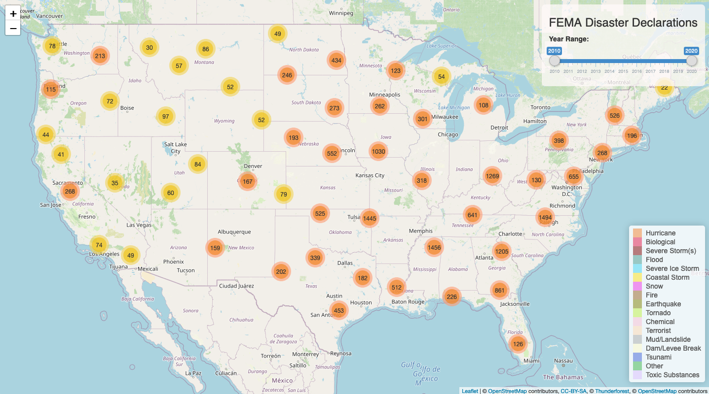

# FEMA Disaster Declarations Map
I created a interactive map of FEMA disaster declarations since 2010 using the R package Shiny and data from FEMA.

## Libraries used
```
library(shiny)
library(leaflet)
library(sp)
library(tidyverse)
library(readxl)
library(sf)
```

## Screenshot


## Current Status
It is hosted at [shinyapps.io](https://c-weave.shinyapps.io/femaDisasterDeclarations/).

## Notes
A little less than 10% of the original data still needs to be mapped.

### Data Source
* [FEMA data sets](https://www.fema.gov/openfema-dataset-disaster-declarations-summaries-v1)